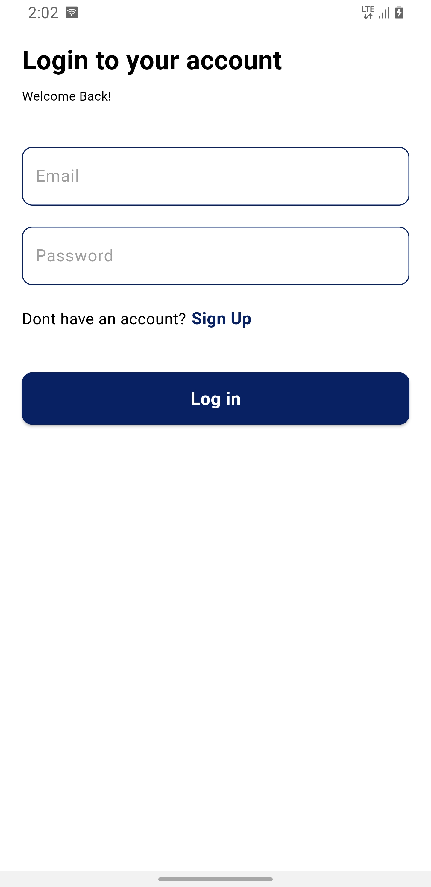
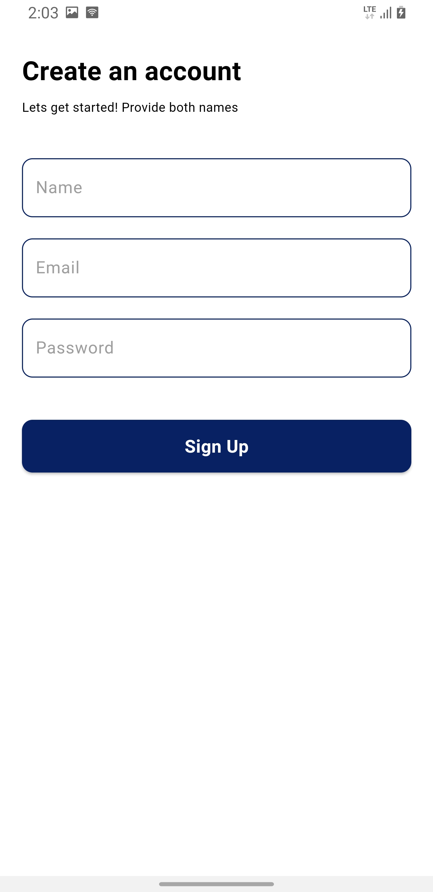
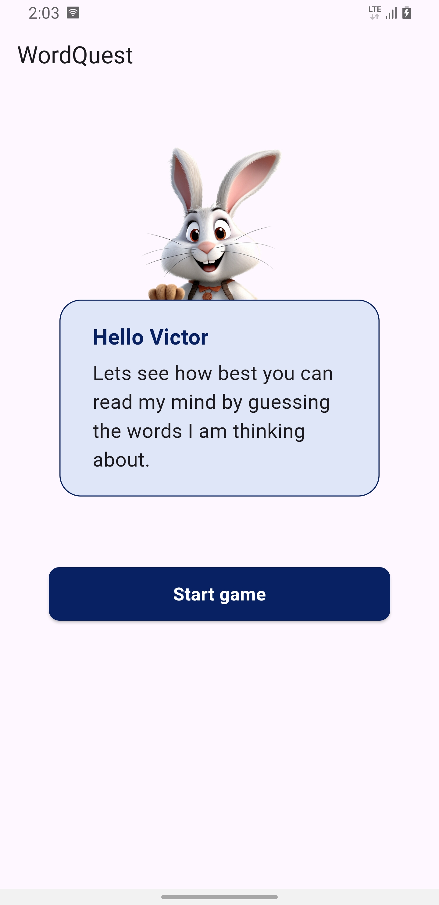
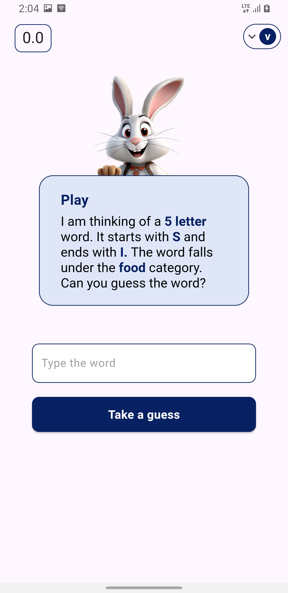
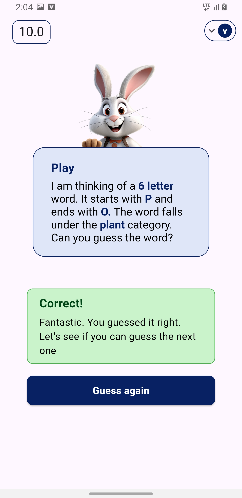
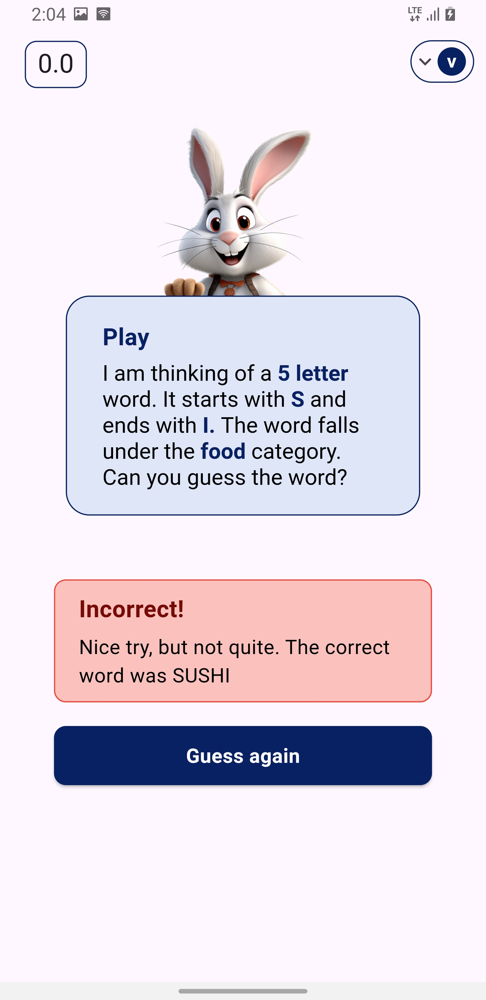

# WordQuest App


WordGame

## :sparkles: App Features

- Authentication
- simple word game

## How to run the application
1. **Clone the repository**

   ```bash
   git clone https://github.com/victor-nsengiyumva/wordQuest-flutter-game
   cd wordquest   

2. Get dependencies

    ```bash
    flutter pub get

 3. run the app
   
    ```bash
    flutter run
    
## :iphone: Screens

Login | Sign up | Home Screen |
:------------:|:-----------:|:--------------:|
 |  |  |
Game Screen | Correct Response | Wrong Response |
 |  |  |


## 🚀 Technologies
- Flutter 3.19.3
- Dart 3.3.1
- Firebase 
